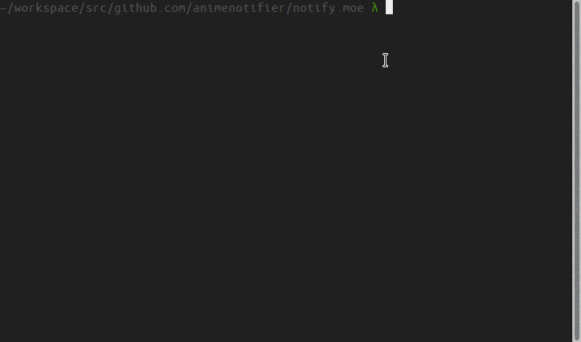

# {name}

{go:header}

Packs the assets for your web server.

{go:install}

## Usage



Run `pack` in your project directory. It will scan your project directory recursively to compile `.pixy`, `.scarlet` and `.js` files resulting in a `components` package in your root directory. You can then import the `components` package in your project to access all of your assets.

### Performance

Pack uses parallel compilation via job queues and is therefore extremely fast, much faster than the popular [webpack](https://github.com/webpack/webpack).

Over 300 assets can be compiled in roughly 50 milliseconds.

## Components

Since `components` is a generated directory you should list this directory in your `.gitignore` file.

### CSS

```go
import "github.com/.../.../components/css"
```

```go
css.Bundle()
```

Returns the CSS bundle which is a string of CSS containing all styles.

### JS

```go
import "github.com/.../.../components/js"
```

```go
js.Bundle()
```

Returns the JS bundle which is a string of JS containing all scripts.

### Templates

```go
import "github.com/.../.../components"
```

Templates are registered as public functions in the `components` package and can be called directly. All components are global, thus you can call a component from one file in another file without any import directives. Components return an HTML `string` but they use a single `bytes.Buffer` via pooling and streaming under the hood, which is extremely fast.

{go:footer}
